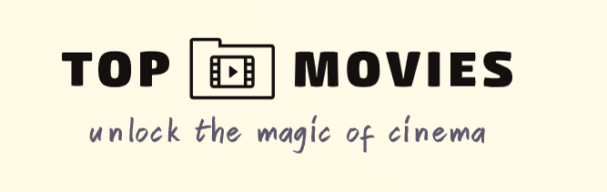

  

<!-- TABLE OF CONTENTS -->

# 📗 Table of Contents

- [📗 Table of Contents](#-table-of-contents)

- [🎥 Top 10 Movies ](#description)

- [🛠 Built With ](#built-with)

  - [Tech Stack](#tech-stack)

- [⭐️ Key Features ](#️key-features)

- [🚀 Live Demo](#live-demo)

- [💻 Install and Getting Started ](#-getting-started-)

  - [Prerequisites](#prerequisites)

  - [Setup](#setup)

  - [Usage](#usage)

  - [Run tests](#run-tests)

  - [Deployment](#deployment)

- [👥 Authors ](#-authors-)

- [🤝 Contributing ](#-contributing-)

- [⭐️ Show your support ](#️-show-your-support-)

- [🙏 Acknowledgments ](#-acknowledgments-)

- [📝 License ](#-license-)

  - [This project is MIT licensed.](#this-project-is-mit-licensed)

<!-- PROJECT DESCRIPTION -->

  

## 🎬🌟 Top 10 Movies 🌟🎥

  

Welcome to Top 10 Movies! This application allows users to explore a curated list of the best movies and interact with them by giving likes and adding comments. It's a platform designed for movie enthusiasts to discover, discuss, and share their thoughts on the top-rated films of all time.

  

## 🛠 Built and implemented with 

- Javascript
- HTML
- CSS

### Tech Stack 

- Webpack
- API
- Linters checkers (JS, CSS, lighthouse, webhint)
- Jest testing
- GIT FLow
- Projects board for organization
  

  
Front End

  <ul>
    <li>HTML</li>
    <li>JAVASCRIPT</li>
    <li>CSS</li>
  </ul>

  
Back End

  <ul>
    <li>TV MAZE API to extract the Movies info</li>
    <li>Involvement API to save comments and likes</li>
  </ul>

(<a href="#readme-top">back to top</a>)

## ⭐️ Key Features 

- **Browse the Top 10:** Get ready to dive into a hand-picked selection of the greatest movies ever made. Explore the list and discover cinematic masterpieces across various genres and eras.
  
- **Like and Comment:** Express your appreciation for the movies by giving them likes and leaving comments. Share your thoughts, recommendations, and engage in discussions with fellow movie lovers.

- **User-Friendly Interface:** The application offers a clean and intuitive user interface, ensuring a seamless browsing experience. Easily navigate through the top movies, view details, and interact with the community.

(<a href="#readme-top">back to top</a>)

## 🚀 Live Demo 

  You can see it working [here](https://jicamargo.github.io/js-capstone/dist/)

<!-- GETTING STARTED -->
## 💻 Install and Getting Started 

You can follow the next steps to review the code or to run the project locally:

1. clone this repo (`git clone https://github.com/jicamargo/js-capstone.git`)

2. cd your-repo

3. Execute `npm install` to install the dependencies

4. Execute `npm run build` to build the project

5. Execute `npm start` to run the project

### Prerequisites

  In order to run this project you need:

  - A modern browser for like Mozilla, Chrome, Edge, etc. that supports HTML5 and CSS

  - A code editor like VSCode, Atom, SublimeText, etc.

### Setup

  Follow the steps above to setup this project in your local environment

### Usage

  Enter to index.html created in ./dist folder or run: npm start in your terminal
  
### Run tests

  run `npm test` in your terminal.

### Deployment

  This project is deployed in github pages, you can see it [here](https://jicamargo.github.io/js-capstone/dist/)

(<a href="#readme-top">back to top</a>)

 
<!-- AUTHORS -->

## 👥 Authors 

### 👤 **Fortune**

  - GitHub: [@Braingenius2](https://github.com/Braingenius2)

  - Twitter: [@fortune](https://twitter.com/fortune)

  - LinkedIn: [LinkedIn](https://linkedin.com/in/fortune)

### 👤 **Jorge Camargo**  

  - GitHub: [@jicamargo](https://github.com/jicamargo)

  - Twitter: [@ji_camargo](https://twitter.com/ji_camargo)

  - LinkedIn: [LinkedIn](https://linkedin.com/in/jorgecamargog)

  _Feel free to reach out to us if you have any questions or collaboration opportunities!_

(<a href="#readme-top">back to top</a>)

<!-- CONTRIBUTING -->

## 🤝 Contributing 

 
We welcome contributions to improve and expand the Top 10 Movies application. If you have any ideas, bug fixes, or new features to propose, please submit a pull request. Make sure to follow the project's guidelines and maintain code quality.

  - Feel free to check the [issues page](../../issues/).
  - Create a new issue [here](../../issues/new)

  
(<a href="#readme-top">back to top</a>)

<!-- SUPPORT -->

## ⭐️ Show your support 

 
If you like this project, please give a ⭐️ (Thank you)

(<a href="#readme-top">back to top</a>)

<!-- ACKNOWLEDGEMENTS -->

  

## 🙏 Acknowledgments 

  

- I would like to thank Microverse for this learning opportunity.

- [Microverse team](https://microverse.org/)

- [TV MAZE API](https://www.tvmaze.com/api) - We would like to thank *TV MAZE API* for providing the movie data used in this application.

- [Involvement API](https://microverse.notion.site/Involvement-API-869e60b5ad104603aa6db59e08150270) We would like to thank *Involvement API* for providing the movie data used in this application.

(<a href="#readme-top">back to top</a>)

  

## 📝 License 

### This project is [MIT](./LICENSE) licensed.
  

(<a href="#readme-top">back to top</a>)
